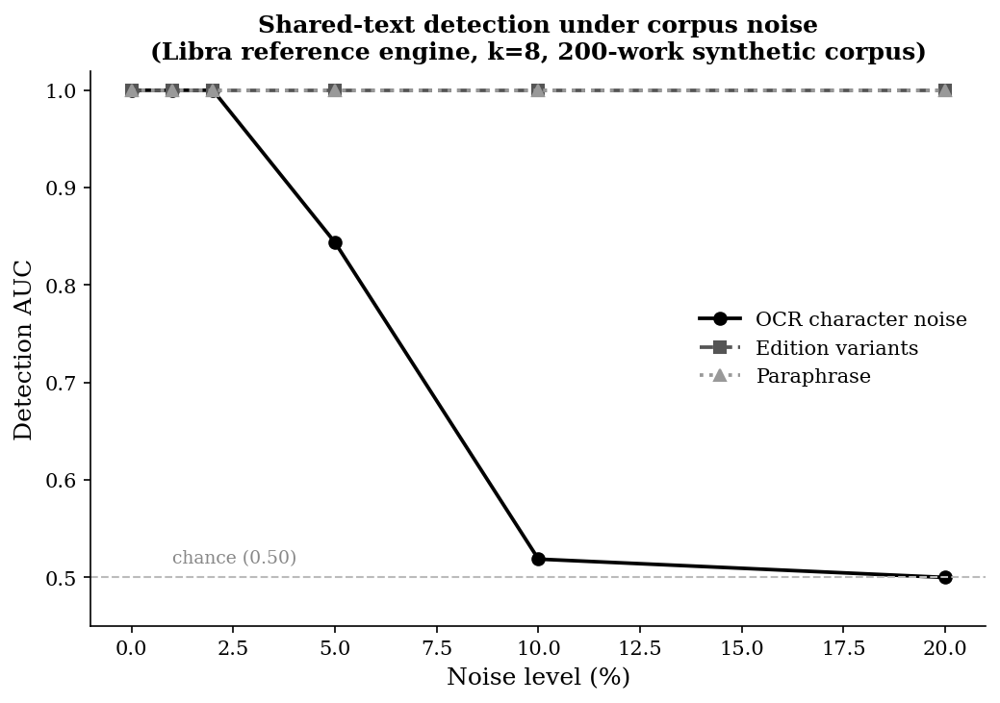

# Scale-and-Noise Benchmark

This benchmark measures whether the reference engine's **uniqueness** measure still
separates works that share text from genuinely distinctive works as a corpus becomes
large and noisy, and how far the resulting allocation shares drift under that noise.
It extends the small clean-corpus validation to realistic conditions.

## What it tests

A synthetic corpus is generated deterministically from a seed. It contains:

- **standalone originals** — distinctive works that share text with nothing else
  (true negatives); and
- **shared-text groups** — pairs of works that share a distinctive core passage,
  one embedding it contiguously and one scattering it (true positives).

Because the uniqueness measure is corpus-relative and treats shared text
symmetrically, every member of a sharing group should read as *less* unique. The
benchmark asks: as noise rises, can low uniqueness still identify the works that
share text?

Three noise families are swept, each at 0–20%:

| Noise | Simulates |
|---|---|
| Edition variants | dropped/duplicated words, spacing, minor edits between editions |
| Paraphrase | synonym substitution and light local reordering |
| OCR | character-level corruption from scanned sources |

**Metric — detection AUC:** the probability that a randomly chosen shared work
scores as more-shared (lower uniqueness) than a randomly chosen original. 1.00 is
perfect separation; 0.50 is chance. **Share drift** is the L1 distance between the
clean allocation and the allocation under noise.

## Results (200-work synthetic corpus, k = 8, seed 20260708)

| Noise type | 0% | 1% | 2% | 5% | 10% | 20% |
|---|---|---|---|---|---|---|
| Edition | 1.00 | 1.00 | 1.00 | 1.00 | 1.00 | 1.00 |
| Paraphrase | 1.00 | 1.00 | 1.00 | 1.00 | 1.00 | 1.00 |
| OCR | 1.00 | 1.00 | 1.00 | 0.84 | 0.52 | 0.50 |

**Reading the results.**

- **Edition variants and paraphrase:** detection stays perfect across the whole
  range. Minor edits and synonym swaps change only a fraction of the eight-word
  shingles, so shared passages remain visible. The separation gap narrows smoothly
  as noise rises, which is the expected, graceful degradation.
- **OCR:** detection is robust up to roughly **2% per-character corruption**, then
  degrades sharply, reaching chance by ~10%. This is an inherent property of
  *exact* shingle matching: a single corrupted character changes an entire
  eight-word shingle's hash, and independent corruption of both copies of a passage
  removes the match. This is a disclosed limitation, not a defect — it bounds the
  conditions under which the exact-shingle instantiation is reliable, and motivates
  an approximate (fuzzy) matching mode as future work.

The numbers above are reproducible: re-running the benchmark at the stated seed
produces byte-identical results.

## Running it

    # fast synthetic run (default 200 works)
    python run_benchmark.py

    # quick CI-sized run
    python run_benchmark.py --quick

    # larger corpus and custom noise sweep
    python run_benchmark.py --n 2000 --levels 0.0 0.01 0.02 0.05

    # run against REAL texts: drop one work per .txt file into a folder
    python run_benchmark.py --texts path/to/gutenberg_txt_folder

When `--texts` is supplied, the harness builds shared-text groups from the supplied
works and applies the same noise sweep, so the identical methodology runs on a real
public-domain corpus (for example, plain-text books from Project Gutenberg) with no
code changes.

## Disclosed parameters

All benchmark parameters are recorded in the output JSON (`benchmark_scale_results.json`):
corpus size, number of shared groups, copy fraction, seed, noise levels, shingle
length *k*, exposure weight, and floor. Changing any of them changes the reported
numbers, and every choice is on the record.
